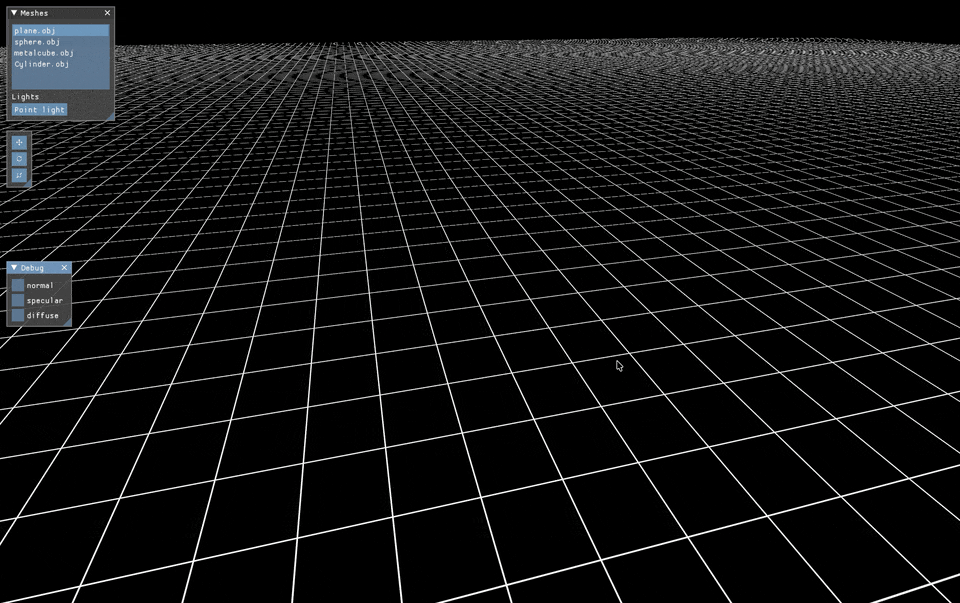

# Metal Renderer

Real-time render engine built with Metal and Swift.


 
## Features

- OBJ loader
- Instanced rendering
- Blinn phong shading model
- Scene graph (n-ary tree)
- Point-light cube map shadow mapping with PCF
- Scene persistance
- ImGui editor layer

### Scene Persistance

Scene is stored as an n-ary tree and can be saved and loaded from disk for persistance. It is stored in the following json data structure:

```json
{
  "rootNode": {
    "assetId": "root",
    "id": "E746668A-A378-4042-833C-FDF1852C7747",
    "nodeType": -1,
    "transform": {
      "position": [0, 0, 0],
      "scale": [1, 1, 1]
    },
    "children": [
      {
        "id": "A5069381-FEAF-4191-B1B6-9069FDD2CE4B",
        "assetId": "e3dd97f8f84d2a54a95aac60bde6e2274cf39fe3073c15fd8c309dc1aa73d978",
        "nodeType": 0,
        "transform": {
          "position": [-0.8385614, 1.1081522, -2.5150156],
          "scale": [1, 1, 1]
        },
        "children": []
      }
    ]
  }
}
```

### Road map
- PBR with cook-torrance specular and Oren-Nayar diffuse BRDF


