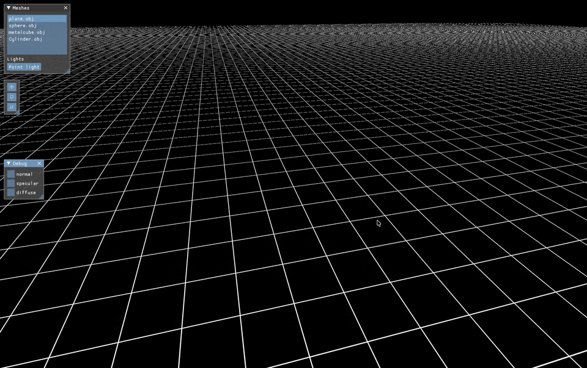

# Metal Renderer

A real-time physically-based render engine built with Metal and Swift.

## Features

### Core Rendering
- **OBJ Loader** - Import 3D models in OBJ format
- **Instanced Rendering** - Efficient GPU-driven instance rendering
- **Dual Shading Models**
  - Blinn-Phong shading for traditional lighting
  - Physically-Based Rendering (PBR) with metallic-roughness workflow
- **Shadow Mapping** - Point light omnidirectional shadows using cube map arrays with PCF filtering

### Scene Management
- **Scene Graph** - N-ary tree structure for hierarchical transforms
- **Scene Persistence** - Save and load scenes to/from disk in JSON format
- **Asset Management** - Centralized asset loading and caching

### Editor
- **ImGui Integration** - Interactive editor layer for scene manipulation
- **Real-time Controls** - Adjust materials, lights, and transforms in real-time

## Physically-Based Rendering


The PBR implementation follows industry-standard techniques for realistic material rendering:

### Diffuse BRDF
Uses the **Disney Diffuse Model** from [Burley 2012](https://media.disneyanimation.com/uploads/production/publication_asset/48/asset/s2012_pbs_disney_brdf_notes_v3.pdf):
- More physically accurate than Lambertian diffuse

### Specular BRDF
Implements the **Cook-Torrance** microfacet model ([Cook & Torrance 1982](https://research.pixar.com/docs/1982.SiggraphPapers.CT.pdf)):
- **Normal Distribution Function (NDF)**: GGX/Trowbridge-Reitz for realistic highlights
- **Geometry Function**: Smith's separable masking-shadowing function
- **Fresnel**: Schlick approximation for angle-dependent reflectance

### Image-Based Lighting (IBL)

Environment-based lighting using prefiltered cube map arrays:
- **Split-sum approximation** following [Epic's 2013 approach](https://cdn2.unrealengine.com/Resources/files/2013SiggraphPresentationsNotes-26915738.pdf)
- **Prefiltered environment maps** - Multiple roughness levels stored in cube texture arrays
- **BRDF Integration LUT** - Precomputed environment BRDF for real-time performance
- **Diffuse and Specular IBL** - Separate contributions for accurate material response

## Shadow Mapping

Point lights use **omnidirectional shadow mapping**:
- Cube map array storage (one cube per light)
- Percentage-Closer Filtering (PCF) for soft shadow edges
- Poisson disk sampling for better quality




- Distance-based depth testing in world space

## Scene Persistence

Scenes are serialized to JSON with a hierarchical structure:

```json
{
  "rootNode": {
    "assetId": "root",
    "id": "E746668A-A378-4042-833C-FDF1852C7747",
    "nodeType": -1,
    "transform": {
      "position": [0, 0, 0],
      "scale": [1, 1, 1]
    },
    "children": [
      {
        "id": "A5069381-FEAF-4191-B1B6-9069FDD2CE4B",
        "assetId": "e3dd97f8f84d2a54a95aac60bde6e2274cf39fe3073c15fd8c309dc1aa73d978",
        "nodeType": 0,
        "transform": {
          "position": [-0.8385614, 1.1081522, -2.5150156],
          "scale": [1, 1, 1]
        },
        "children": []
      }
    ]
  }
}
```

Each node includes:
- Unique identifier (UUID)
- Asset reference (SHA-256 hash)
- Transform data (position, rotation, scale)
- Children array for hierarchy

## Technical Details

### Graphics API
- **Metal** - Apple's low-level graphics API
- **MetalKit** - Texture loading and view management
- **Metal Performance Shaders** - GPU-accelerated image processing

### Architecture
- **Forward rendering pipeline** - Single-pass rendering with multiple materials
- **Cube texture arrays** - Efficient storage for environment maps and shadow maps
- **GPU-driven rendering** - Minimize CPU overhead with instancing

## Building

1. Open the `.xcodeproj` file in Xcode
2. Build and run (⌘R)

Requires:
- Xcode 14.0+
- macOS 12.0+ deployment target
- Metal-capable Mac

## References

- [Disney BRDF Paper (2012)](https://media.disneyanimation.com/uploads/production/publication_asset/48/asset/s2012_pbs_disney_brdf_notes_v3.pdf)
- [Cook-Torrance Reflectance Model (1982)](https://research.pixar.com/docs/1982.SiggraphPapers.CT.pdf)
- [Real Shading in Unreal Engine 4 (2013)](https://cdn2.unrealengine.com/Resources/files/2013SiggraphPresentationsNotes-26915738.pdf)
